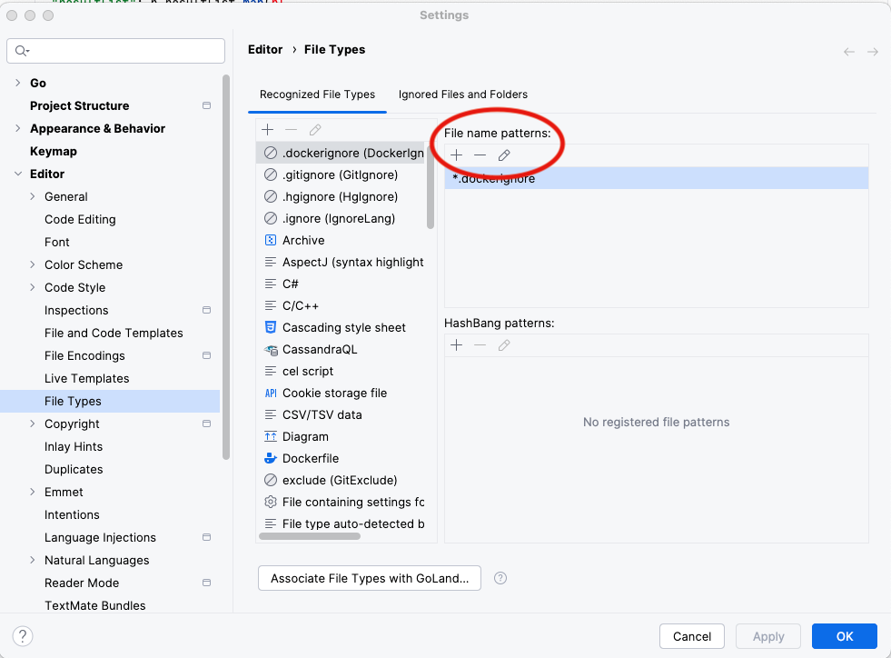
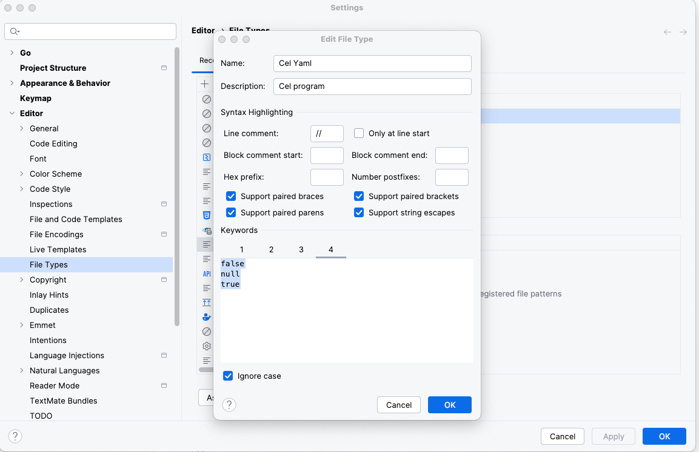
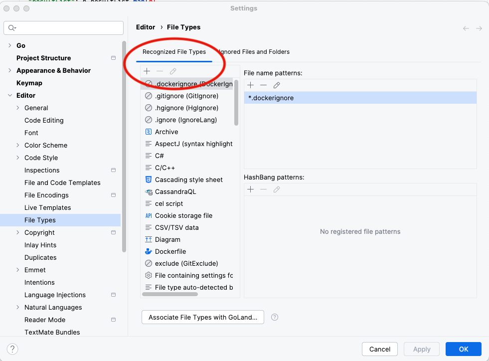
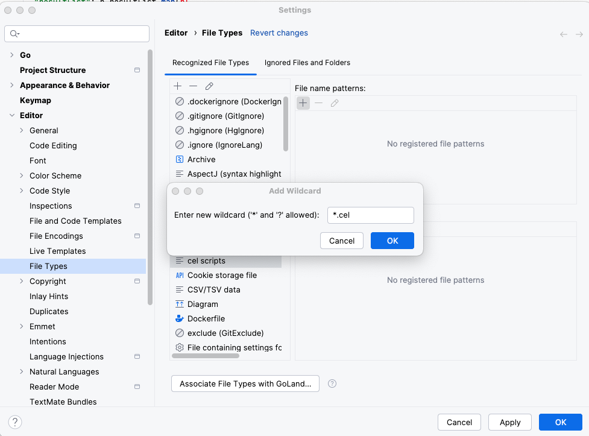

# How to setup an editor in Intellij products for CEL

These instructions will associate cel script files with an editor that
supports matching braces, brackets and parenthesis as well as autocomplete 
on keywords. The keywords list that are added are all the macros supported by 
CEL and the Elastic extensions in mito.

To access autocomplete, start typing one of the keywords. A dropdown of possible
completions will appear. To access all the possible keywords without typing hit 
CTRL-Space and a dropdown of all the keywords will appear for selection.

 

## Setting up the Editor

These instructions are based on  Goland version 2025.1.1 on a Macbook Pro

In the Intellij product 

1. Menu-\>settings-\>File Types  
2. Click on (+) at top of Recognized File Types  
   
3. Check boxes as shown and add the list of macros to the Keywords panel



Keywords 1 (CEL expressions). These can be accessed as a dropdown from
within the editor.

```
all
as
base6
base64_decode
base64_raw
base64_raw_decode
basic_authentication
bool
bytes
close
collate
compare
contains_any
contains_substr
count
debug
decode_json
decode_json_stream
decode_xml
dir
do_request
double
drop
drop_empty
duration
dyn
encode_json
endswith
equal_fold
exists
exists_one
fields
file
filter
flatten
format
format_query
format_url
front
get
get_request
getdayofyear
getfullyear
gethours
getmilliseconds
getminutes
getmonth
getseconds
has
has_prefix
has_suffix
head
hex
hex_decode
hmac
in
index
index_any
int
is_error
join
keys
last_index
last_index_any
list
map
matches
max
md5
mime
min
now
numericequals
optional.none
optional.of
orvalue
parse_query
parse_time
parse_url
post
post_request
rate_limit
re_find
re_find_all
re_find_all_submatch
re_find_submatch
re_match
re_replace_all
repeat
replace
replace_all
request
send_to
sha1
sha256
size
split
split_after
split_after_n
split_n
sprintf
startswith
string
substring
sum
tail
time_layout
to_lower
to_title
to_upper
to_valid_utf8
trim
trim_left
trim_prefix
trim_right
trim_space
trim_suffix
try
type
uint
uuid
valid_utf8
values
with
with_replace
with_update
zip
```

Keyword 2 \- highlight common variable names. Helps with visually parsing
the program. 

```
accept_header
access_key
access_key_id
access_token
account
api_host
api_key
api_token
api_url
api_version
apikey
audience
auth
aws_region
azure
azure_tenant_id
base
base_url
batch_size
body
client_credentials
client_id
client_secret
content_header
credentials
credentials_file
credentials_json
cursor
data
data_path
delegated_account
enable_request_tracer
end_time
endpoint_params
google
grant_type
http_client_timeout
id
initial_interval
initial_interval_days
interval
is_token_valid
jwt_file
jwt_json
limit
logs
max
max_time_range
min
min_time_range
oauth2
offset
page
page.start
page_limit
page_size
page_start
period
periodic_vars
preserve_duplicate_custom_fields
preserve_original_event
processors
project_id
provider
proxy_url
query
resource_keep_alive
resource_max_body_size
resource_max_executions
resource_rate_limit_burst
resource_rate_limit_limit
resource_redirect_forward_headers
resource_redirect_headers_ban_list
resource_redirect_max_redirects
resource_retry_max_attempts
resource_retry_wait_max
resource_retry_wait_min
resource_ssl
resource_timeout
resp
scopes
secret_key
session_timeout
ssl
start_id
start_time
state
status
statuscode
sub_path
tag
tags
tenant_id
time_format
time_range
timeout
token
token_path
token_scope
token_scopes
token_url
tracer
url
want_more
```

Keywords 3 \- yml fields. Helps with visually parsing the file.

```
account_id:
apikey:
audience:
auth.oauth2.azure.
auth.oauth2.azure.resource:
auth.oauth2.azure.tenant_id:
auth.oauth2.client.id:
auth.oauth2.client.secret:
auth.oauth2.endpoint_params:
auth.oauth2.google.credentials_file:
auth.oauth2.google.credentials_json:
auth.oauth2.google.delegated_account:
auth.oauth2.google.jwt_file:
auth.oauth2.google.jwt_json:
auth.oauth2.google:
auth.oauth2.password:
auth.oauth2.provider:
auth.oauth2.scopes:
auth.oauth2.token_url:
auth.oauth2.user:
auth.oauth2:
azure.resource:
azure.tenant_id:
azure:
base_url:
batch_size:
client.id:
client.secret:
client_id:
client_secret:
cluster_uuid:
config_version:
credentials_file:
credentials_json:
custom_url:
data_path:
delegated_account:
enabled:
end_field:
end_point_type:
endpoint_params:
fields:
fields_under_root:
filename:
google.credentials_file:
google.credentials_json:
google.delegated_account:
google.jwt_file:
google.jwt_json:
google:
grant_type:
id:
initial_interval:
initial_interval_days:
interval:
jwt_file:
jwt_json:
keep_null:
limit:
look_back:
maxbackups:
page_size:
path:
period:
processors:
program:
provider:
publisher_pipeline.disable_host:
redact:
regexp:
request.tracer.maxbackups:
resource.keep_alive:
resource.max_body_size:
resource.max_executions:
resource.proxy_url:
resource.rate_limit.burst:
resource.rate_limit.limit:
resource.redirect.forward_headers:
resource.redirect.headers_ban_list:
resource.redirect.max_redirects:
resource.retry.max_attempts:
resource.retry.wait_max:
resource.retry.wait_min:
resource.ssl:
resource.timeout:
resource.tracer.filename:
resource.tracer:
resource.url:
scopes:
secret:
secret_key:
start_field:
state:
sub_path:
tags:
tenant_id:
time_field:
time_format:
token_path:
token_url:
xsd:

```

Keywords 4 \- program keywords

```
false
null
true

```

4. Click OK.  
5. Click on (+) under File name patterns:  
   
6. Add file suffixes that you want associated with cel script files. (suggest \*.cel and \*.yml.hbs or cel.yml.hbs to differentiate from httpjson files)  
     
   
7. Click OK 